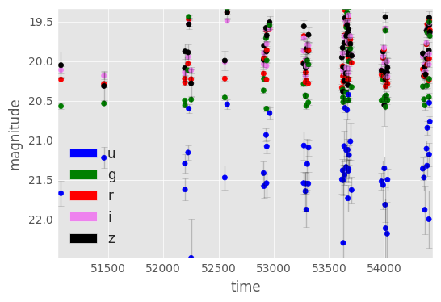
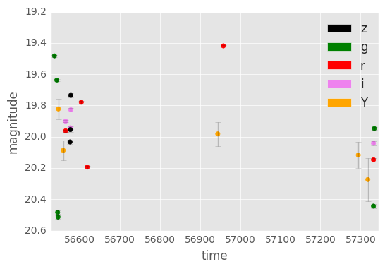

# RR Lyrae Templates

Fit templates to RR Lyrae variable stars to estimate periods, amplitudes, and distances. The code takes data like this:

and outputs 5 parameters (distance modulus $$\mu$$, dust $E[B-V]$, amplitude, frequency, and phase) which can be used to construct the folded light curve:

The model is designed to work even on very sparsely sampled light curves. For example this Dark Energy Survey RR Lyrae

